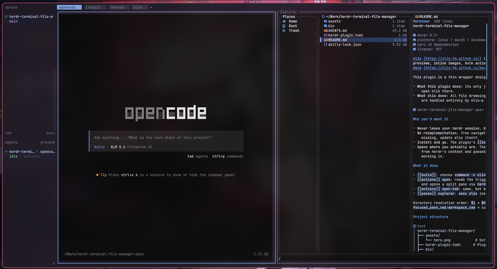

# herdr-terminal-file-manager


[elio](https://elio-fm.github.io/) is a **snappy, batteries-included terminal file manager with rich previews, inline images, bulk actions, and trash support.** — [website](https://elio-fm.github.io/) · [docs](https://elio-fm.github.io/docs/) · [GitHub](https://github.com/elio-fm/elio)

**A thin wrapper that opens elio inside a [herdr](https://herdr.dev) pane.** All file browsing, preview, and file operations are elio's own — this plugin's only job is finding the directory you're actually working in and opening elio there.



## Why you'd want it

- **Never leave your herdr session.** Browse and preview files without switching to another app.
- **No reimplementation.** Tree navigation, previews, file operations — all real elio. If a feature is missing, update elio itself.
- **Install and go.** The plugin's `[[build]]` step installs elio via `cargo install` if it's missing.
- **Opens where you actually are.** The directory of the pane/workspace that triggered the key is read from herdr's context and passed via `--cwd`, so elio always opens in the folder you were just working in.

## What it does

- `[[build]]`: checks `command -v elio`, runs `cargo install elio` if missing.
- `[[actions]] open`: reads the triggering pane/workspace's directory from `$HERDR_PLUGIN_CONTEXT_JSON` and opens a split pane via `herdr plugin pane open --placement split --cwd`.
- `[[actions]] open-tab`: same, but with `--placement tab` to open in a new tab instead.
- `[[panes]] explorer`: `exec elio` inside that pane.

Directory resolution order: `$1` → `$HERDR_EXPLORER_DIR` → `HERDR_PLUGIN_CONTEXT_JSON`'s `focused_pane_cwd`/`workspace_cwd` → current directory.

## Project structure

```
herdr-terminal-file-manager/
├── assets/
│   └── hero.png            # Screenshot of elio in a herdr pane
├── herdr-plugin.toml      # Plugin manifest — declares id, actions, panes, build
├── bin/
│   └── resolve-dir.sh     # Resolves the target directory from context/env/args
└── README.md
```

- `herdr-plugin.toml` — the contract between herdr and the plugin. Declares metadata, build steps, pane entrypoints, and actions.
- `bin/resolve-dir.sh` — standalone shell script that resolves the working directory from, in order: CLI argument → `$HERDR_EXPLORER_DIR` → `HERDR_PLUGIN_CONTEXT_JSON` → `pwd`. Works with or without herdr.

## Quick start

### 1. Install elio

#### cargo (cross-platform)

```bash
cargo install elio
```

#### Arch Linux

```bash
paru -S elio
```

#### Fedora

```bash
sudo dnf copr enable miguelregueiro/elio
sudo dnf install elio
```

#### Debian / Ubuntu

```bash
curl -fsSL https://elio-fm.github.io/elio-apt/install.sh | sudo sh
sudo apt install elio
```

#### Homebrew (macOS)

```bash
brew install elio
```

#### Optional preview tools

```bash
# Arch
sudo pacman -S poppler ffmpeg resvg 7zip

# Fedora
sudo dnf install poppler-utils ffmpeg resvg 7zip

# Debian/Ubuntu
sudo apt install poppler-utils ffmpeg resvg 7zip

# Homebrew
brew install poppler ffmpeg resvg sevenzip
```

See the [full installation guide](https://elio-fm.github.io/install/) for more options.

### 2. Install the plugin

```bash
herdr plugin install robert-flo/herdr-terminal-file-manager
```

### 3. Add keybindings

Add to `~/.config/herdr/config.toml`:

```toml
[[keys.command]]
key = "prefix+y"
type = "plugin_action"
command = "robert-flo.elio.open"
description = "open file explorer"

[[keys.command]]
key = "prefix+Y"
type = "plugin_action"
command = "robert-flo.elio.open-tab"
description = "open file explorer in a new tab"
```

### 4. Reload config

```bash
herdr server reload-config
```

`prefix+y` opens a split, `prefix+Y` (Shift+y) opens a new tab.

## Keys

This plugin defines no keys of its own — the pane runs plain elio, so every keybinding is [elio's own](https://elio-fm.github.io/docs/).

## Development

```bash
herdr plugin install robert-flo/herdr-terminal-file-manager   # install from GitHub
herdr plugin action invoke robert-flo.elio.open
```

`bin/resolve-dir.sh` is a standalone shell script, testable without herdr:

```bash
HERDR_PLUGIN_CONTEXT_JSON='{"focused_pane_cwd":"/some/dir"}' bin/resolve-dir.sh
```

## Troubleshooting

### elio not found after install

Ensure `~/.cargo/bin` is in your `PATH`, or install elio via your package manager instead.

### Plugin not showing in herdr

Run `herdr plugin list` to confirm it's installed. If missing, run `herdr plugin install robert-flo/herdr-terminal-file-manager` again.

### Actions not working

Check the plugin logs:

```bash
herdr plugin log list --plugin robert-flo.elio
herdr plugin log read --plugin robert-flo.elio --latest
```

### Config not reloading

Run `herdr server reload-config` after editing `config.toml`. If that doesn't work, restart herdr.

## Acknowledgments

A huge thank you to [speardragon](https://github.com/speardragon) for creating [herdr-yazi](https://github.com/speardragon/herdr-yazi). This plugin is entirely inspired by their original idea, and I am deeply grateful for their open-source contribution. This project also directly benefits from their `bin/resolve-dir.sh` script, which is used here without any modifications.

Please note that if you prefer using **Yazi**, the original [speardragon/herdr-yazi](https://github.com/speardragon/herdr-yazi) is a perfect and completely valid option for your setup!

## Requirements

- [elio](https://elio-fm.github.io/) — install via `cargo install elio` or your package manager.
- [herdr](https://herdr.dev) ≥ 0.7.0.
- A [Nerd Font](https://www.nerdfonts.com/) in your terminal for correct icon rendering.

---

<small>The screenshot on this page was taken in [kitty](https://sw.kovidgoyal.net/kitty/) with `font_family JetBrainsMonoNL NF`.</small>
